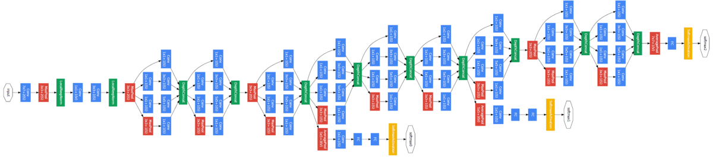

# Training GoogleNet from scratch 
Train MiniGoogLeNet and GoogLeNet on CIFAR-10 and Tiny ImageNet datasets.
## Code objective
- Build MiniGoogLeNet and train the network on CIFAR-10 dataset. 
- Build GoogLeNet and train the network on Tiny ImageNet dataset.
## Packages
- Python 3.6
- Cuda 10.2
- cuDNN 7.6.5
- Tensorflow 2.0
- Numpy
- scikit-learn 0.22
- imutils 0.5.3
## Training Template
Tuning and optimizing deep-learning networks is more about intuition, practice  and patience than a technique. Choosing the correct hyper-parameters and getting a complex network to learn properly can be daunting to developers not well versed in the craft. Getting a deep neural network to converge by selecting the optimal hyper-parameters is a difficult task. This difficulty grows quickly with the complexity of a neural network model. The main questions: (1) Is the learning rate right? (2) The regularization too strong? (3) The dropout keep rate too low? (4) Does the model have sufficient learning capacity? All these questions are difficult to answer.
## GoogleNet
In 2014 Christian Szegedy introduced a new Deep CNN architecture named inception in his paper Going Deeper with Convolutions. The author  achieved a new state of the art for classification and detection in the ImageNet Large-Scale Visual Recognition Challenge 2014. The main innovation of this architecture is the improved utilization of the computing resources inside the network. The author demonstrated how to increase the depth and width of the network while keeping the computational budget constant.
The obvious way to improve the performance of deep neural networks is by increasing their size.This includes both increasing the depth:  the number of network levels and increasing the width: the number of units at each level.  However, this will lead to two main problems:  
With GoogleNet the idea is to increase the number of filters by using inception modules. While designing this model they have considered the computational budget fixed. Therefore, this model is suitable for embedded systems and mobile and edge applications. Despite 22 layers, the number of parameters used used is 12 time less than AlexNet but its accuracy is significantly better.

## MiniGoogLeNet on CIFAR-10
The architecture consists of a conv_module, inception_module downsample_module
